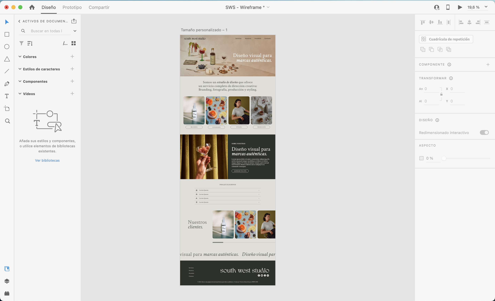

# Proyecto 3 - Landing de Negocio

En este proyecto se aplicaron los conceptos de prototipado simple, etiquetas estándar HTML5 y CSS. 

## Planteamiento

Construir una página landing para un negocio, donde debe incluirse:

-Prototipado simple, en papel o utilizando un programa de dibujo.
-Muestra de los mensajes de negocio
-Breve catálogo de productos
-Incluir estas secciones en la interfaz: Header, Main, Products y footer.

## Solución explicada paso a paso

1. Para comenzar, realice un prototipo en Adobe xd con la estructura general del sitio, esto sirvió como base sobre la cual se trabajaría el proyecto. Se definió ahi el diseño de header, main, footer, además de look and feel en tipografias y colores. A medida que se trabajó en el proyecto se hicieron cambios y mejoras.

2. Se trabajó archivo HTML donde se establecieron las etiquetas del sitio, sus diferentes secciones, además de los links correspondientes.

3. Se trabajó archivo CSS para definir los estilos propuestos en el prototipo.
